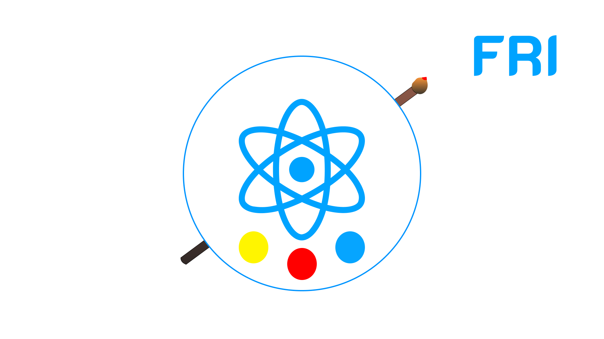

# fabricjs-react-improve upgrade of fabricjs-react by Tobias Almada

## Message for you
I created this project based on another library because I needed it for a job but the original library did not allow me to do several things that I needed as a developer.
I hope you can find it useful like me 
## Objective
The main objective of this library is to provide a simple tool for solving common canvas problems.
Allowing a simple use within react by transferring the difficulty of the native api canvas and other libraries like fabricjs to a few lines of code.
to this end, we seek to implement
+ Reusable components
+ A canvas that can communicate with other components
+ a lot of parameters that allow to perform many complex functions in a straightforward way
+ very good performance the library seeks an experience similar to that of native apps

## Components
this software library adds the following components to enhance the developer experience
### ControlProvider

## Thanks to Alejandro Soto
This library was not started as a project from scratch but is a fork of another library called fabricjs-react developed by Alejandro Soto. \
we can't leave aside his important creation since the base of the library was made by him you can make a donation to that person through the following URL:
<a href="https://www.buymeacoffee.com/alecode">Donation for Alejandro Soto</a>